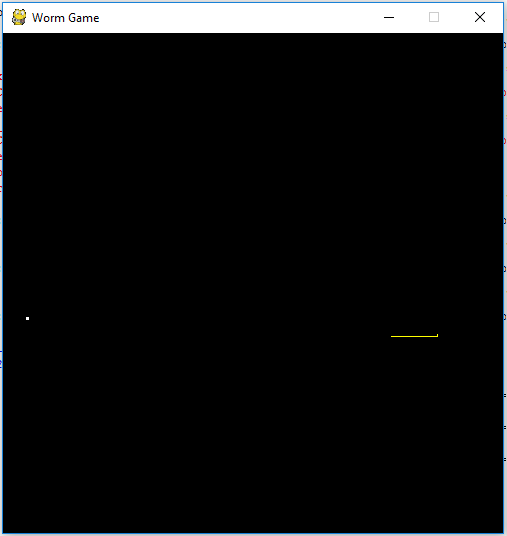

Pygame Tutorial
===============




Python Pygame game based on Based on [pygame-tutorial](https://lorenzod8n.wordpress.com/category/pygame-tutorial/). 
You control a worm that move around the screen looking for food. 
When the worm gets the food, you get some points and the worms grows longer. 
Crashing onto yourself or the borders ends the game.


Pre-requisites
--------------
- Windows 10 - 64bits
- Python 3.5.2 - 64 bits
- Pygame 1.9.2


### Install Python components
For Windows 10 - 64 bits:
```
1. Install python.
1.1 Download the installer from https://www.python.org/downloads/
1.2 Install python, pip and select add python to environment variables from custom installer.
1.3 To test it, run pip from the terminal.

2. Install pygame.
2.1 See http://dharmaaworks.blogspot.mx/2015/11/installing-pygame-for-python-35-on.html
2.2 Download pygame (pygame-1.9.2-cp35-cp35m-win_amd64.whl)
2.3 Run the command from the terminal as Administrator:   
    pip install pygame-1.9.2-cp35-cp35m-win_amd64.whl
2.4 To test it
    import pygame.examples.aliens as game
    game.main()	
```

### Running the game
In the terminal run
``` python WormGame.py ```


License
-------
Copyright 2016 Angel Garcia

Licensed to the Apache Software Foundation (ASF) under one or more contributor
license agreements.  See the NOTICE file distributed with this work for
additional information regarding copyright ownership.  The ASF licenses this
file to you under the Apache License, Version 2.0 (the "License"); you may not
use this file except in compliance with the License.  You may obtain a copy of
the License at

http://www.apache.org/licenses/LICENSE-2.0

Unless required by applicable law or agreed to in writing, software
distributed under the License is distributed on an "AS IS" BASIS, WITHOUT
WARRANTIES OR CONDITIONS OF ANY KIND, either express or implied.  See the
License for the specific language governing permissions and limitations under
the License.